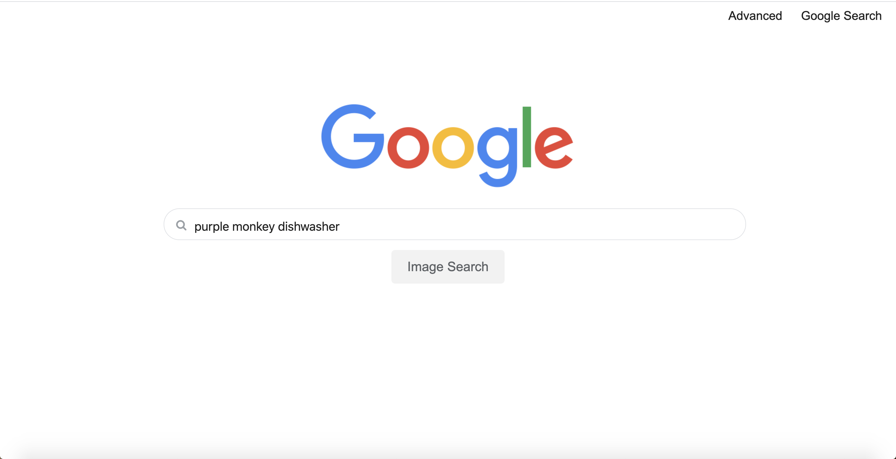
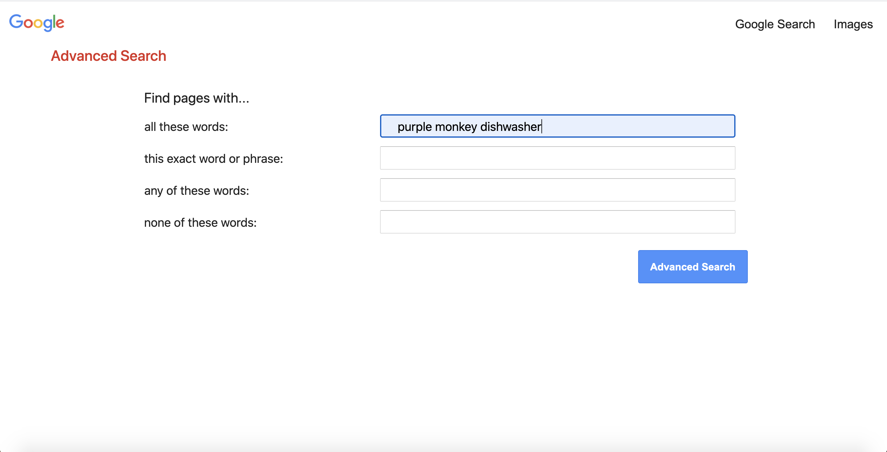

# cs50_web_development_project0_2020
Project 0 **"Search"** for the newest version of [Harvardx CS50 Web Programming with Python and Javascript](https://cs50.harvard.edu/web/2020/). A simple application which sends search requests to google with the parameters of basic text search, image search, and advanced search (including all keywords, exact keywords, any keywords and none of the keywords).

### check it out [here](https://luxlewis.github.io/cs50_web_development_project0_2020/) ###

